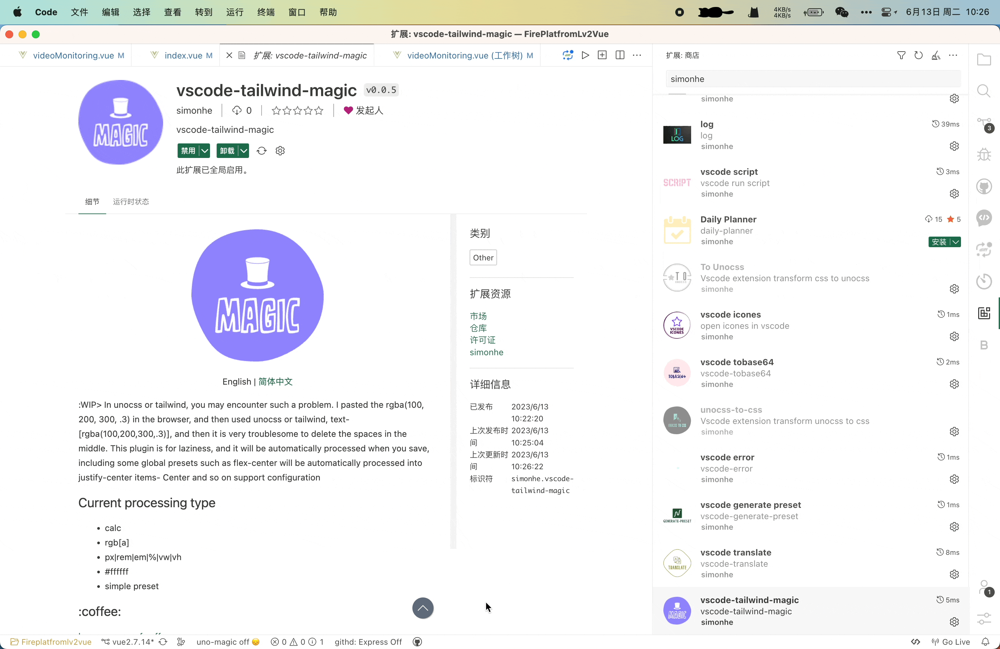

 <a href="./README.md">English</a> | 简体中文

:WIP> 在unocss或tailwind中,你可能会遇到这样的问题我粘贴了浏览器中的rgba(100, 200, 300, .3),然后再用unocss或者tailwind的写法,text-[rgba(100,200,300,.3)],然后就需要很麻烦的删除中间的空格,这个插件就是为了偷懒,在你保存时自动处理, 包括一些全局的预设比如flex-center会自动处理成justify-center items-center 等等支持配置

## 目前处理类型
- calc
- rgb[a]
- px|rem|em|%|vw|vh
- #ffffff
- simple preset
- w|h|gap|m|mt|mr|mb|ml|p|pt|pr|pb|pl|b|bt|br|bb|bl|lh|top|right|bottom|left
- w1! -> !w-1
- w--1 -> -w-1
- maxw10px -> max-w-10px

## :coffee:

[请我喝一杯咖啡](https://github.com/Simon-He95/sponsor)

## License

[MIT](./license)
